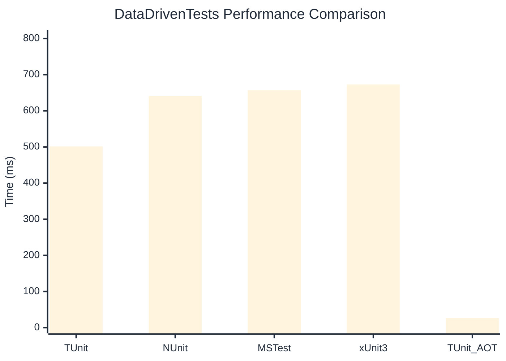

# DataDrivenTests Benchmark

:::info Last Updated
This benchmark was automatically generated on **2026-03-02** from the latest CI run.

**Environment:** Ubuntu Latest • .NET SDK 10.0.103
:::

## 📊 Results

| Framework | Version | Mean | Median | StdDev |
|-----------|---------|------|--------|--------|
| **TUnit** | 1.18.0 | 501.57 ms | 501.32 ms | 2.171 ms |
| NUnit | 4.5.0 | 640.95 ms | 640.67 ms | 8.961 ms |
| MSTest | 4.1.0 | 657.20 ms | 658.23 ms | 8.886 ms |
| xUnit3 | 3.2.2 | 673.08 ms | 673.50 ms | 7.168 ms |
| **TUnit (AOT)** | 1.18.0 | 26.70 ms | 26.70 ms | 0.149 ms |

## 📈 Visual Comparison

## 🎯 Key Insights

This benchmark compares TUnit's performance against NUnit, MSTest, xUnit3 using identical test scenarios.

---

:::note Methodology
View the [benchmarks overview](/docs/benchmarks) for methodology details and environment information.
:::

*Last generated: 2026-03-02T11:12:57.401Z*
