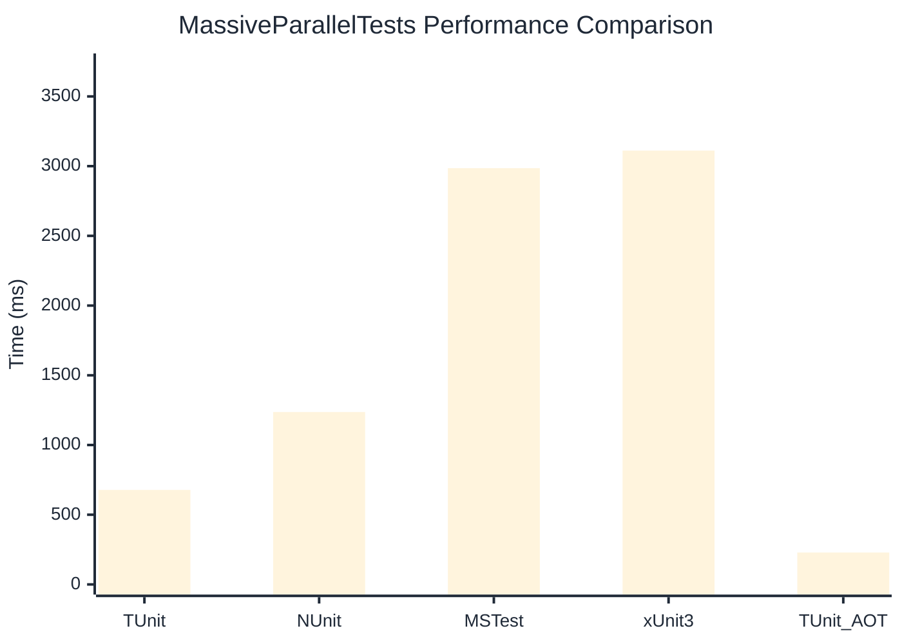

# MassiveParallelTests Benchmark

:::info Last Updated
This benchmark was automatically generated on **2026-02-28** from the latest CI run.

**Environment:** Ubuntu Latest • .NET SDK 10.0.103
:::

## 📊 Results

| Framework | Version | Mean | Median | StdDev |
|-----------|---------|------|--------|--------|
| **TUnit** | 1.17.54 | 677.9 ms | 676.8 ms | 6.41 ms |
| NUnit | 4.5.0 | 1,236.6 ms | 1,236.1 ms | 7.05 ms |
| MSTest | 4.1.0 | 2,985.6 ms | 2,986.8 ms | 5.46 ms |
| xUnit3 | 3.2.2 | 3,111.8 ms | 3,109.7 ms | 7.91 ms |
| **TUnit (AOT)** | 1.17.54 | 229.2 ms | 229.3 ms | 0.80 ms |

## 📈 Visual Comparison

## 🎯 Key Insights

This benchmark compares TUnit's performance against NUnit, MSTest, xUnit3 using identical test scenarios.

---

:::note Methodology
View the [benchmarks overview](/docs/benchmarks) for methodology details and environment information.
:::

*Last generated: 2026-02-28T00:32:29.748Z*
