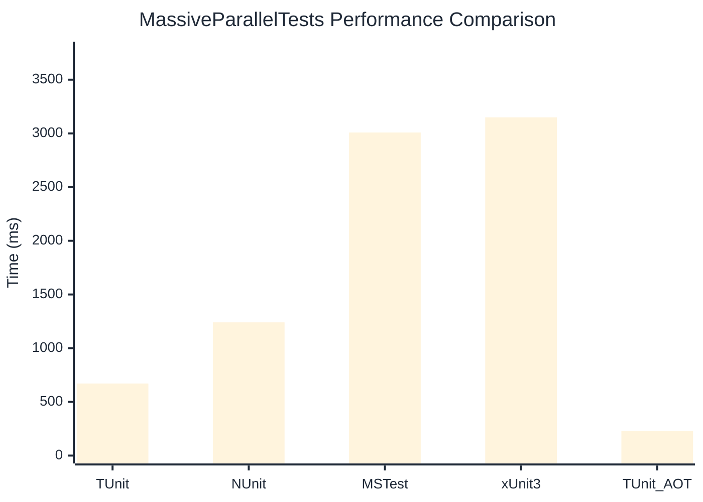

# MassiveParallelTests Benchmark

:::info Last Updated
This benchmark was automatically generated on **2026-03-02** from the latest CI run.

**Environment:** Ubuntu Latest • .NET SDK 10.0.103
:::

## 📊 Results

| Framework | Version | Mean | Median | StdDev |
|-----------|---------|------|--------|--------|
| **TUnit** | 1.17.54 | 670.7 ms | 670.6 ms | 3.23 ms |
| NUnit | 4.5.0 | 1,240.3 ms | 1,241.0 ms | 6.48 ms |
| MSTest | 4.1.0 | 3,008.7 ms | 3,005.7 ms | 8.02 ms |
| xUnit3 | 3.2.2 | 3,149.7 ms | 3,149.7 ms | 14.72 ms |
| **TUnit (AOT)** | 1.17.54 | 230.6 ms | 230.4 ms | 0.84 ms |

## 📈 Visual Comparison

## 🎯 Key Insights

This benchmark compares TUnit's performance against NUnit, MSTest, xUnit3 using identical test scenarios.

---

:::note Methodology
View the [benchmarks overview](/docs/benchmarks) for methodology details and environment information.
:::

*Last generated: 2026-03-02T09:18:26.354Z*
