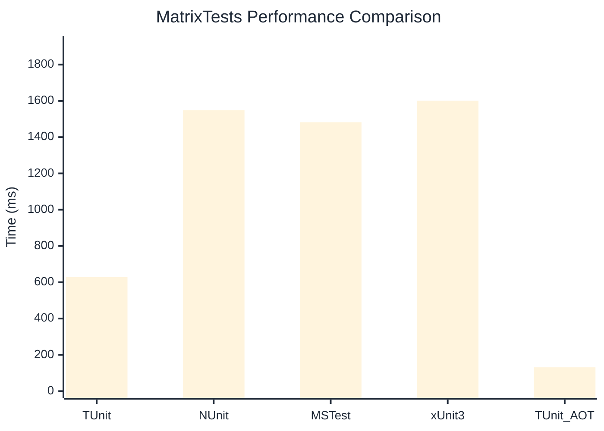

# MatrixTests Benchmark

:::info Last Updated
This benchmark was automatically generated on **2026-03-02** from the latest CI run.

**Environment:** Ubuntu Latest • .NET SDK 10.0.103
:::

## 📊 Results

| Framework | Version | Mean | Median | StdDev |
|-----------|---------|------|--------|--------|
| **TUnit** | 1.18.0 | 629.1 ms | 628.9 ms | 8.14 ms |
| NUnit | 4.5.0 | 1,547.9 ms | 1,547.0 ms | 6.73 ms |
| MSTest | 4.1.0 | 1,482.1 ms | 1,477.0 ms | 12.08 ms |
| xUnit3 | 3.2.2 | 1,600.6 ms | 1,598.8 ms | 7.24 ms |
| **TUnit (AOT)** | 1.18.0 | 131.4 ms | 131.4 ms | 0.52 ms |

## 📈 Visual Comparison

## 🎯 Key Insights

This benchmark compares TUnit's performance against NUnit, MSTest, xUnit3 using identical test scenarios.

---

:::note Methodology
View the [benchmarks overview](/docs/benchmarks) for methodology details and environment information.
:::

*Last generated: 2026-03-02T11:12:57.402Z*
