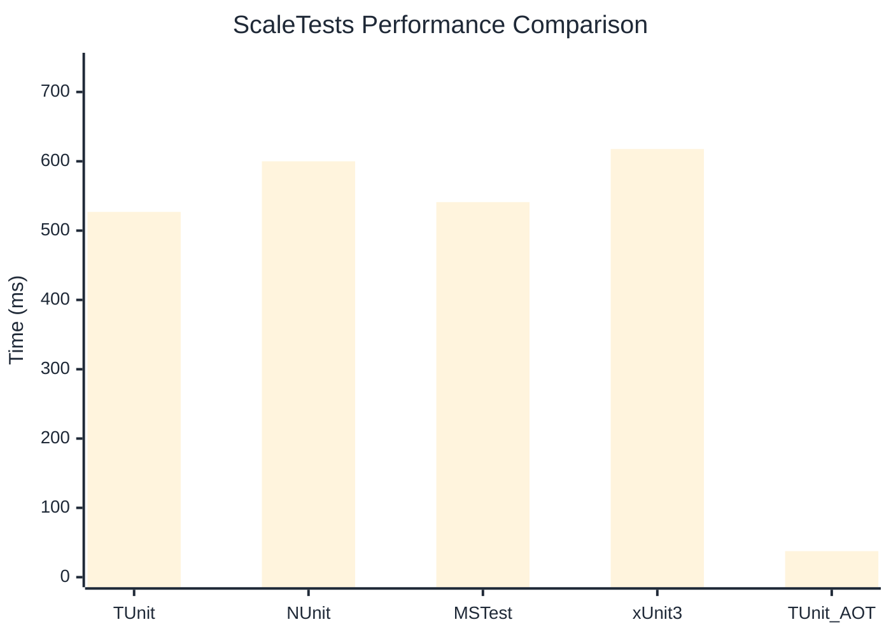

# ScaleTests Benchmark

:::info Last Updated
This benchmark was automatically generated on **2026-03-02** from the latest CI run.

**Environment:** Ubuntu Latest • .NET SDK 10.0.103
:::

## 📊 Results

| Framework | Version | Mean | Median | StdDev |
|-----------|---------|------|--------|--------|
| **TUnit** | 1.18.0 | 526.99 ms | 525.19 ms | 4.914 ms |
| NUnit | 4.5.0 | 600.02 ms | 598.91 ms | 7.122 ms |
| MSTest | 4.1.0 | 541.11 ms | 541.78 ms | 12.797 ms |
| xUnit3 | 3.2.2 | 617.72 ms | 616.28 ms | 10.664 ms |
| **TUnit (AOT)** | 1.18.0 | 37.60 ms | 37.43 ms | 1.883 ms |

## 📈 Visual Comparison

## 🎯 Key Insights

This benchmark compares TUnit's performance against NUnit, MSTest, xUnit3 using identical test scenarios.

---

:::note Methodology
View the [benchmarks overview](/docs/benchmarks) for methodology details and environment information.
:::

*Last generated: 2026-03-02T11:12:57.402Z*
